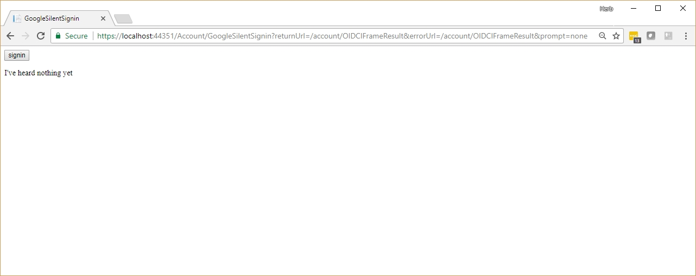

# prompt=none OIDC signin  
This project is an implementation of signin via a javascript initiated iFrame.  

I am using Google OIDC as my IDP for this implementation.  

## What's needed  

The app has some secrets, which are set using "Manage User Secrets"    
```
{
  "Google-ClientId": "blah.apps.googleusercontent.com",
  "Google-ClientSecret": "blah"
}
```

1. **JavaScript Library for Secure Cross Domain iFrame Communication.**  

I picked [ternarylabs porthole](https://ternarylabs.github.io/porthole/).  
Your signin will be happening in an iFrame which is going to be hidden.  That iFrame job will attempt to log in, and will know that state.  A successful login will result in your app having dropped cookies, however the iFrame is the only thing on the client that knows the state.  Your hosting page will need to be updated.  There is a couple ways you can implement how your hosting page knows this;
1. The hosting page polls the hosted iFrame.  I prefer this technique, as it covers the case where your iFrame catastrophically fails.
2. The hosted iFrame communicates out the state.

**A pro implemenatation is that you will have both.**  

My portal hole implementation source..  
[The Proxy Page](Pages/Account/iFrameProxy.cshtml)  
[Hosted iFrame Signin Page](Pages/Account/OIDCIFrameResult.cshtml)  
[Hosting Signin Page](Pages/Account/GoogleSilentSignin.cshtml)  


2. **OIDC Options**  
[google setup](InMemory/InMemoryIdentityServiceCollectionExtensions.cs)  
I have introduced passing in prompt=none and an errorUrl to compliment the returnUrl.  


## Usage  
Normal login still works as is, but lets do the silent approach.  

1. go to [Google Accounts](https://myaccount.google.com/), and login and logoff there.  
2. Navigate to our [Test Page](https://localhost:44351/Account/GoogleSilentSignin?returnUrl=/account/OIDCIFrameResult&errorUrl=/account/OIDCIFrameResult&prompt=none)  




